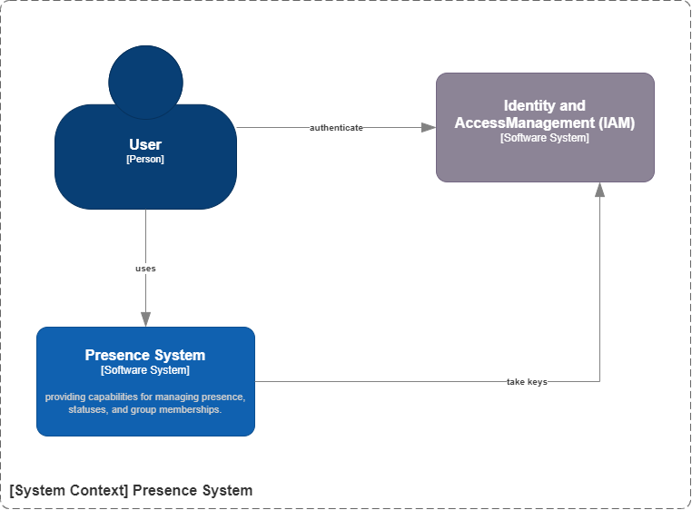
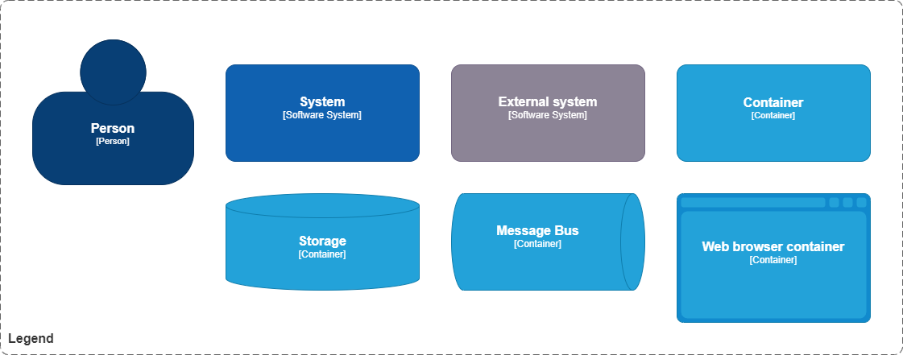
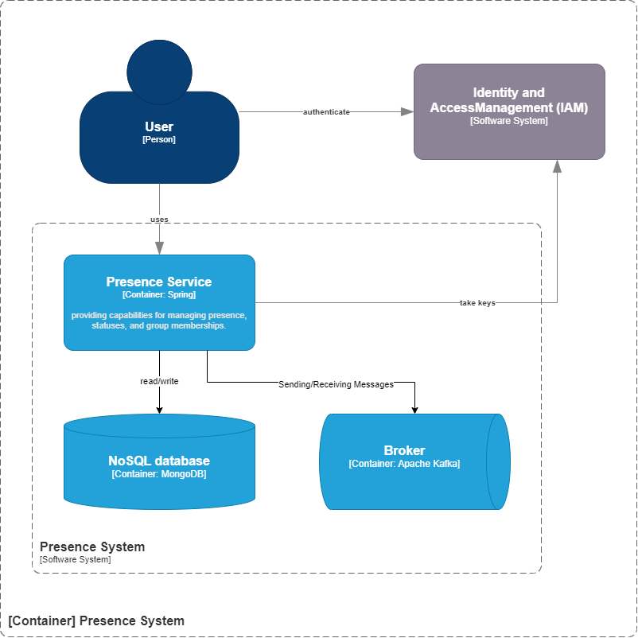
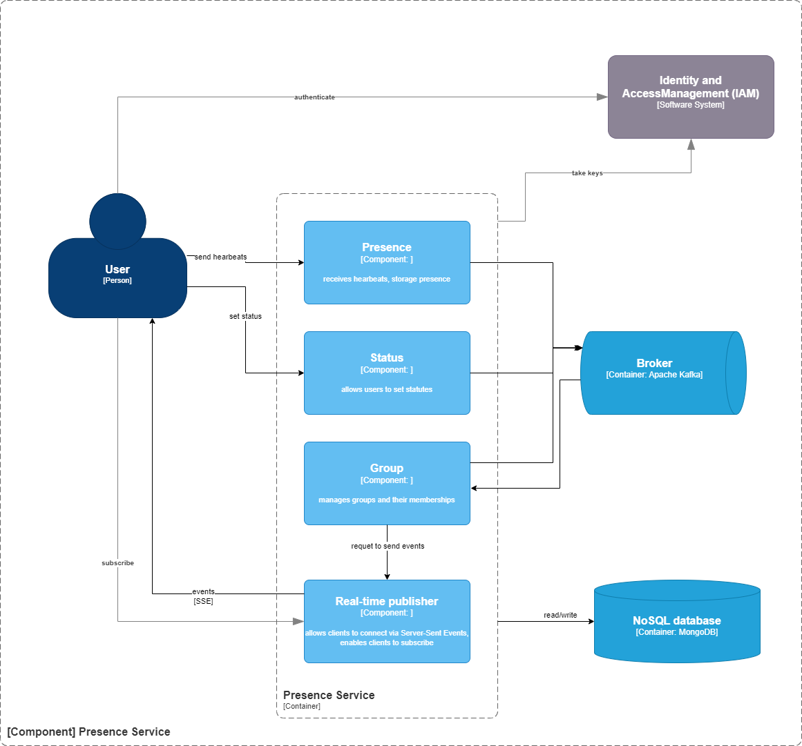
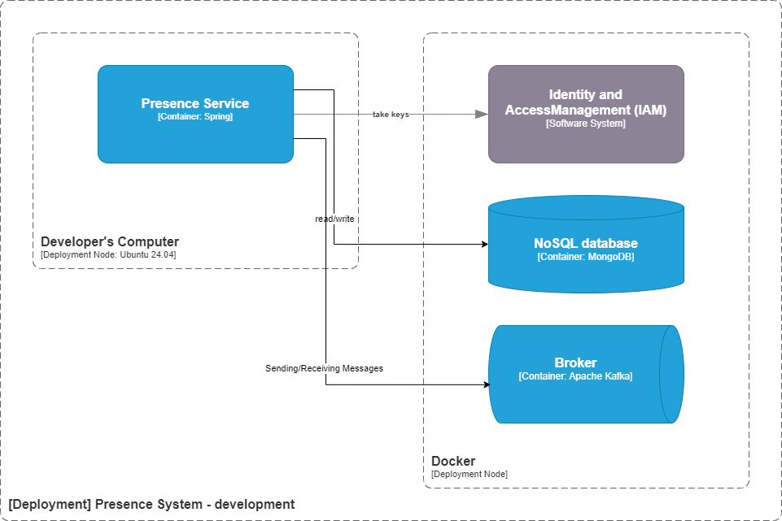

# Presence System Architecture
_This document outlines the architectural blueprint for system, providing a structured and comprehensive overview of its design, components, and operational considerations. 
The report leverages the arc42 template for its standardized, pragmatic structure and integrates the C4 model for clear, hierarchical visual representations of the architecture._

The Presence System is a microservice designed to manage user presence data, including their online status, and custom statuses.
Its core components include HTTP endpoints for heartbeats, status management, group management, and a real-time publisher component utilizing Server-Sent Events (SSE). 
This system integrates with Keycloak for security and authorization.

# Table of Contents
1. [Introduction and Goals](#1-introduction-and-goals)
2. [Architecture Constraints](#2-architecture-constraints)
3. [System Scope and Context](#3-system-scope-and-context)
4. [Solution Strategy](#4-solution-strategy)
5. [Building Block View](#5-building-block-view)
6. [Runtime View](#6-runtime-view)
7. [Deployment View](#7-deployment-view)
8. [Crosscutting Concepts](#8-crosscutting-concepts)
9. [Architecture Decisions](#9-architecture-decisions)
10. [Quality Requirements](#10-quality-requirements)
11. [Risks and Technical Debt](#11-risks-and-technical-debt)
12. [Glossary](#12-glossary)
12. [Attachments](#13-attachments)

# 1. Introduction and Goals
_This section establishes the foundational context for the system, defining its purpose, identifying stakeholders, and outlining the quality attributes that guide its design._

## 1.1. Requirements Overview

The primary functional requirements of the Feedback System involve:
- receiving Heartbeat signals;
- storing presence status;
- allowing user status configuration;
- real-time publishing - system must allow clients to connect via SSE and subscribe to specific groups to receive real-time updates.

## 1.2. Quality Goals
The top quality attributes for the System are critical drivers for its architectural design. These include:
- **Availability**  over consistency to ensure continuous availability of presence functionality; 
- **Scalability** to support a growing number of data;
- Strong **security** for user data and access control through fine-grained permissions;
- **Low latency** for real-time status updates.

## 1.3. Stakeholders
| Name      | Describtion                                                   | Primary Sections of Interest  |
| --------  | -------                                                       | -------                       | 
| End-User  | System functionality                                          | 1, 3.1, 6                     |
| Developer | Code structure, APIs, integration points, implementation      | 4, 5, 6, 8, 9, 11             |
| DevOps    | Deployment, infrastructure, monitoring, scalability           | 5, 6, 7, 8, 10, 11            |

# 2. Architecture Constraints
_This section delineates the significant limitations and restrictions that exert influence over the architectural design and subsequent implementation of the system._

- The system must function as a microservice, promoting loose coupling between services;
- It must use standard protocols such as OAuth2 and OpenID Connect to ensure security;
- Clients will use Server-Sent Events (SSE) for real-time updates.

# 3. System Scope and Context
_This section precisely defines the boundaries of the system and illustrates its interactions with external systems._

## 3.1. Business Context
The business context describes the system as a black box, illustrating its interactions with various users and other systems in its environment.




# 4. Solution Strategy
_This section provides a high-level summary of the fundamental architectural decisions and guiding principles that shape the system's design._

| Goal                    | Description                                                                                                                                                                                                                                                                                                                                                                                                                                                                                                                                                                            |
|-------------------------|----------------------------------------------------------------------------------------------------------------------------------------------------------------------------------------------------------------------------------------------------------------------------------------------------------------------------------------------------------------------------------------------------------------------------------------------------------------------------------------------------------------------------------------------------------------------------------------|
| microservices approach  | The overall architectural style adopted for the system leans towards a microservices approach. This choice supports key design principles such as an API-first approach, promoting loose coupling between services. Additionally, the system is designed from the ground up to be highly optimized for horizontal scalability, allowing for easy replication and distribution of service instances across multiple servers or containers. This ensures the system can efficiently handle increasing loads by simply adding more resources, without significant architectural changes.  |
| security                | Keycloak was chosen for robust identity management, leveraging its support for standard protocols like OAuth2 and OpenID Connect.                                                                                                                                                                                                                                                                                                                                                                                                                                                      |
| real-time communication | The use of Server-Sent Events (SSE) for real-time communication ensures a unidirectional data flow from server to client, ideal for streaming status updates.                                                                                                                                                                                                                                                                                                                                                                                                                          |

# 5. Building Block View
_This section describes the static decomposition of system into its major software components, referred to as building blocks, and illustrates their relationships._

This diagram depicts the main systems: Presence System and IAM.


| System                                      | Description                                                 |
|---------------------------------------------|-------------------------------------------------------------|
| Presence System                             | The main system managing user presence and statuses.        |
| Identity and Access Management (IAM) system | System responsible for authentication and user management.  |

## 5.1. Level 1: Container Level - Presence System
The Presence System is a microservice providing capabilities for managing presence, statuses, and group memberships. 
It allows users to communicate their current status (online, idle, offline) and custom statuses, as well as managing their relationships within groups for better scalability.
The system operates as a Resource Server, utilizing scopes to manage access permissions.

This diagram provides a clear overview of the system's major deployable units and their communication pathways.




| Containers       | Description                                                                                                                                                                                                               |
|------------------|---------------------------------------------------------------------------------------------------------------------------------------------------------------------------------------------------------------------------|
| Presence Service | The core service responsible for handling heartbeats, managing user presence status, custom statuses, group memberships, and publishing real-time updates. It orchestrates interactions between its internal components.  |
| NoSQL database   | Store data                                                                                                                                                                                                                |
| Broker           | To send and receive messages                                                                                                                                                                                              | 

### 5.1.1. Level 2: Component Level - Presence Service
Provides system functionality to user.
Project is on [Github](https://github.com/dawidbladek0831/f23-presence)



#### 5.1.1.1. Design
To model the domain, the DDD (Domain-Driven Design) approach was applied. More information in [Attachments](#13-attachments).

#### 5.1.1.2. REST API documentation
Comprehensive documentation for the REST API can be accessed via the following [link](https://www.postman.com/dawidbladek0831/f23).


#### 5.1.1.3 Level 3: Code Level - Presence Component
- Heartbeat - receives heartbeat signals every 10 seconds
```json
{
  "presence": "string (e.g. 'ONLINE', 'IDLE', 'OFFLINE')",
  "user_id": "string (external ID)",
  "timestamp": "timestamp (e.g. 2398020423)"
}
```
The IDLE event is client-side driven (e.g., Angular app detects 5 minutes of inactivity). An absence of heartbeats implies OFFLINE.


- Presence Storage 
```json
// USER PRESENCE - DOMAIN MODEL
{
  "user_id": "string (external ID)",
  "presence": "string (e.g. 'ONLINE', 'IDLE', 'OFFLINE')",
  "lastSeen": "UTC"
}
```

- Event Emission - emits events when a user's presence status changes.


#### 5.1.1.4 Level 3: Code Level - Status  Component
User Status - allows users to set custom statuses similar to Discord (e.g., Available, Away, Do Not Disturb, Invisible, or custom message).

Domain Model
```json
// USER STATUS - DOMAIN MODEL
{
  "user_id": "string (external ID)",
  "status": {
    "type":"string (e.g., 'ONLINE', 'IDLE', 'DO_NOT_DISTRUB', 'INVISIBLE')",
    "message":"string",
    "metadata":{
      "notification":"boolean"
    }
  },
  "customMessage":"string (e.g., 'Doing homework!')"
}
```


#### 5.1.1.5 Level 3: Code Level - Group Component
- Group Management - manages groups and their user memberships.
Domain Model
```json
// GROUP MEMBER - DOMAIN MODEL
{
    "domainObjectTye": "string (e.g. 'FRIEND_LIST', 'CHANNEL', 'GROUP', 'ROOM')",
    "domainObjectId": "string (external ID )",
    "userId":"string (external ID)"
}
```


There is no convention at the moment, but i think 3-4 groups will suffice. For example: 
```json
// USER group, special one member group, any other user can subscribe to it and will receive events about the status of that user. Kasia and Basia have their own USER groups.
{
    "domainObjectType": "USER",
    "domainObjectId": "Ala",
    "members":["Ala"]
}
// FRIEND_LIST group, only Ala is subscribed to this group, as this is a friend list. If Kasia or Basia changes status, Ala will be notified. Kasia and Basia have their own FRIEND_LIST groups.
{
	"domainObjectType": "FRIEND_LIST",
	"domainObjectId": "Ala",
	"members":[ "Kasia", "Basia"]
}
// and at the end, normal group, to which all members subscribe.
{
    "domainObjectType": "CHANNEL",
    "domainObjectId": "1L",
    "members":[ "Ala", "Kasia", "Basia"]
} 
// so when an SSE channel is opened, Ala subscribes to her FRIEND_LIST and, for example, the CHANNEL-L1 group to receive notifications about friends's statuses and channel members's statuses.
```

#### 5.1.1.6 Level 3: Code Level - Real-time Publisher Component
- SSE Connection - allows clients to connect via Server-Sent Events (SSE).

- Subscriptions - enables clients to subscribe to specific groups to receive real-time updates on user status changes within those groups.

## 5.2. Level 1: Container Level - Identity and Access Management (IAM) System
The system integrates Keycloak as the Identity and Access Management (IAM) solution, eliminating the need to develop custom authentication and authorization mechanisms. This choice reduces development effort, enhances security, and ensures compliance with modern authentication standards like OAuth2 and OpenID Connect.


# 6. Runtime View
_This section details the dynamic behavior of the system by illustrating how its building blocks interact over time to fulfill key use cases and scenarios._

## 6.1. General Runtime Scenario
1. Client connect and subscribe - A user client connects to the Real-time Publisher Component via SSE and subscribes to selected groups (e.g., a friend list or a chat channel).
2. Initial group member fetch - simultaneously, the client fetches the initial list of group members.
3. Real-time updates - from this point forward, the client manages the group membership locally. Any changes occurring within the subscribed groups (e.g., user presence status updates, custom status changes) are received by the client in real-time via the SSE connection from the Real-time Publisher Component.

## 6.2. Heartbeats
1. Client send heartbeat - every 10/30 seconds, the user client sends an HTTP heartbeat signal indicating ONLINE or IDLE status.
2. Presence status update - service receives the heartbeat, updates the user's presence status.
3. Event emission - if the user's presence changes (e.g., from ONLINE to IDLE), **Presence Component** emits update event.
4. **Group Component**  receive events and identifies affected groups and directly sends an update by **Real-time Publisher Component** to all subscribed clients via SSE.

## 6.3. Status Update
1. User sets status - a user sets a status (e.g., "Do Not Disturb") via an API call.
2. **Status Component** store status and emit update events.
3. **Group Component** receive events and identifies affected groups and directly sends an update by **Real-time Publisher Component** to all subscribed clients via SSE.

# 7. Deployment View
_This section shows the technical infrastructure where the System is deployed._

# 7.1. Development environment


## 7.1.1. Setup infrastructure 
### Kafka

    $ docker compose -p f -f ./.docker/docker-compose-kafka.yaml up -d

### Mongo

    $ docker compose -p f -f ./.docker/docker-compose-mongo.yaml up -d

## 7.1.2. Setup external systems
### IAM
Run keycloak and dedicated postgres database:

    $ docker compose -p f -f ./.docker/docker-compose-auth.yaml up -d

Config realm
- Create realm using file ./.config/realm-export.json

## 7.1.3. Presence Service
### 7.1.3.1. Running
#### Development
Build everything 

    $ .\gradlew service:presence:build

Start application:

    $ .\gradlew sservice:presence:bootRun

#### Docker
In some development workflows, it might be preferable to run just image.

    $ docker run -p 8080:8080 ghcr.io/dawidbladek0831/presence:latest

### 7.1.3.2. Dockerization 
The Service can be containerized by building a Docker image. The project's Dockerfile is located in the .docker/Dockerfile path.

To build the Docker image, the docker buildx build command is utilized.

    $ sudo docker buildx build . -f .docker/Dockerfile -t ghcr.io/dawidbladek0831/presence:latest

To change image's tag to corresponding version

    $ docker tag ghcr.io/dawidbladek0831/presence:latest ghcr.io/dawidbladek0831/presence:1.0.0

To push image to registy:

    $ docker push ghcr.io/dawidbladek0831/presence:latest


# 8. Crosscutting Concepts
_This section describes overarching principles and patterns that are relevant across multiple parts of the System._

## 8.1. Presence Business Polices
- **User Disconnection Policy** - if presence servers did not receive a heartbeat within a certain time from the client, a user is considered as OFFLINE;

## 8.2. Group Business Policy
- **Group Member Status Changed Send Policy** - if group size is smaller than 30, events are send by **Direct Event Send Policy** otherwise **Group Status Event Send Policy**.
- **Direct Event Send Policy** - event is sent directly to subscribers over opened SEE channel.
- **Group Status Event Send Policy** - every 30s Aggregated event is sent to every subscribe.

## 8.3 Authentication and Authorization
The system functions as a Resource Server and integrates Keycloak as the Identity and Access Management (IAM) solution. This approach eliminates the need for custom authentication and authorization mechanisms, leveraging standard protocols like OAuth2 and OpenID Connect. The system's security model is based on scopes, where specific roles grant access to corresponding scopes.

The table below presents the basic roles required to obtain the corresponding scopes. 
For example, to obtain the scope `ps.group-read `, the `ps.group:read ` role must be assigned.


| Base role               | Scope                   | Access Granted                                      |
|-------------------------|-------------------------|-----------------------------------------------------|
| ps.group-read           | ps.group:read           | Permission to read any group.                       |
| ps.group-write          | ps.group:write          | Permission to create, change or delete own group.   |
| ps.group-manage         | ps.group:manage         | Permission to create, change or delete any group.   |
|                         |                         |                                                     |
| ps.heartbeat-write      | ps.heartbeat:write      | Permission to send heartbeat.                       |
| ps.presence-read        | ps.presence:read        | Permission to read any presences.                   |
|                         |                         |                                                     |
| ps.sse-write            | ps.sse:write            | Permission to open own sse                          |
| ps.sse-manage           | ps.sse:manage           | Permission to open any sse                          |
| ps.subscription-write   | ps.subscription:write   | Permission to create or delete own subscription     |
| ps.subscription-manage  | ps.subscription:manage  | Permission to create or delete  any subscription    |
|                         |                         |                                                     |
| ps.status-read          | ps.status:read          | Permission to read any status.                      |
| ps.status-write         | ps.status:write         | Permission to create, change or delete own status.  |
| ps.status-manage        | ps.status:manage        | Permission to create, change or delete any status.  |


To simplify role management, higher-level roles like fs.admin and fs.user aggregate these basic roles.

| Base role\Role          | ps.admin | ps.user |
|-------------------------|----------|---------|
| ps.group-read           | +        | +       |
| ps.group-write          | +        | +       |
| ps.group-manage         | +        | -       |
|                         |          |         |
| ps.heartbeat-write      | +        | +       |
| ps.presence-read        | +        | +       |
|                         |          |         |
| ps.sse-write            | +        | +       |
| ps.sse-manage           | +        | -       |
| ps.subscription-write   | +        | +       |
| ps.subscription-manage  | +        | -       |
|                         |          |         |
| ps.status-read          | +        | +       |
| ps.status-write         | +        | +       |
| ps.status-manage        | +        | -       |


# 9. Architecture Decisions
_Architectural decisions are made with specific trade-offs and constraints in mind._

## 9.1. Decision: Using Keycloak for Identity Management

    Data: 2025-8-8

    Status: Accepted

    Context: The system requires robust user authentication and authorization, support for standard protocols (OAuth2, OpenID Connect), and centralized user management capabilities.

    Decision: Integrate Keycloak as the primary identity provider for user authentication and authorization.

    Consequences:

        Easier: Leverages a mature, open-source solution for secure authentication, supports industry-standard protocols, provides a comprehensive administration console for user management, and enables future SSO capabilities.

        Harder: Requires Keycloak setup, configuration, and ongoing maintenance, introduces a learning curve for developers to integrate with OAuth2/OpenID Connect flows, and adds another component to the system's operational footprint.

# 10. Quality Requirements
_This section details the measurable quality scenarios for the System._

# 10.1. Performance Tests

During normal operation, on a machine with approximately 6–8 GB of RAM, the system was able to handle 10,000–15,000 users,
with the p95 latency not exceeding 5 seconds for the HTTP interface and not exceeding 10 seconds for the SSE interface. 
However, when the user status changed on every Heartbeat, the system experienced issues at around 7,000–8,000 users,
with p95 latency reaching 10 seconds for HTTP and exceeding 30 seconds for SSE.

# 11. Risks and Technical Debt
_This section identifies known problems, potential risks, and accumulated technical debt within the System._

# 11.1 User Status
Currently, user statuses are hardcoded in the application and cannot be modified through the API.

# 12. Glossary
_This section defines important business and technical terms used throughout the documentation to ensure consistent understanding and reduce ambiguity._

| Term                               | Describtion                                                                                                                                                                                                                                                    |
|------------------------------------|----------------------------------------------------------------------------------------------------------------------------------------------------------------------------------------------------------------------------------------------------------------|
| ADR (Architecture Decision Record) | A document that captures an important architectural decision made along with its context, options, and consequences.                                                                                                                                           |
| C4 Model                           | A visual notation technique for documenting software architecture at different levels of abstraction: Context, Container, Component, and Code.                                                                                                                 |
| OAuth2 / OpenID Connect            | Industry-standard protocols used by Keycloak for secure authorization and authentication.                                                                                                                                                                      | 
| Domain Object                      | A Domain Object is a target entity in system. It is identified by:  `domainObjectType` (e.g. `"POST"`) and `domainObjectId` (unique identifier within that type). In practice, `domainObjectType` + `domainObjectId` form the global identifier of the target. |
| Heartbeat Signal                   | A periodic message sent from a client to the Presence Component indicating the client's current status (e.g., ONLINE, IDLE).                                                                                                                                   |
| Server-Sent Events (SSE)           | A standard allowing a web page to receive automatic updates from a server via an HTTP connection. It's a one-way communication channel from the server to the client.                                                                                          |

# 13. Attachments
Design - [design.md](design.md)